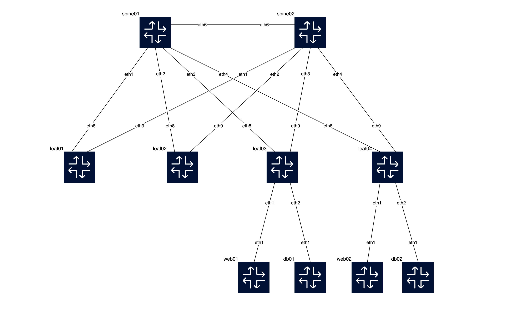

# Lab for Arista EOS-based data center fabric
This lab consists of 2 spines and  4 leafs, emulating a typical leaf-spine data center fabric.



db0[1-2] and web0[1-2] are linux containers for testing purpose, emulating VMs. db0[1-2] are on VLAN 10 and web0[1-2] are on VLAN 20 respectively.

## Containerlab topology definitions
### dc1.empty.clab.yml
This is a containerlab toplogy file, which includes initial sets for the network, with the aim of demoing [the ansible playbooks](../arista-ansible-lab/README.md).

### dc1.clab.yml
This is a containerlab toplogy file, which includes a full set of configurations. This setup is equalization to the state after running the series of playbooks. 

## Prepare container image
### 1. Get cEOS image
Arista requires its users to register with arista.com before downloading any images. Once you created an account and logged in, go to the [software downloads](https://www.arista.com/en/support/software-download) section and download ceos64 tar archive for a given release. For example, you can download `cEOS-lab-4.34.0F.tar.xz`.

### 2. Import the container image
Once downloaded, import the archive with docker:
```
$ docker import cEOS64-lab-4.34.0F.tar.xz ceos:4.34.0F

$ docker images
REPOSITORY                TAG            IMAGE ID       CREATED       SIZE
ceos                      4.34.0F        0e7a421f759a   3 weeks ago   2.49GB
```
Please refer to the [containerlab user manual](https://containerlab.dev/manual/kinds/ceos/#arista-ceos) for more details.

## Deploy
You can deploy the lab and consequently demo the series of playbooks. 
```
$ cd arista-clab
$ containerlab deploy -t dc1.empty.clab.yml 
```
You can also deploy directly the state of after running the series of playbooks (just before configuring VLANs), if you want.
```
$ containerlab deploy -t dc1.clab.yml
```
Please refer to the [containerlab user manual](https://containerlab.dev/manual/kinds/ceos/#arista-ceos) for more details.