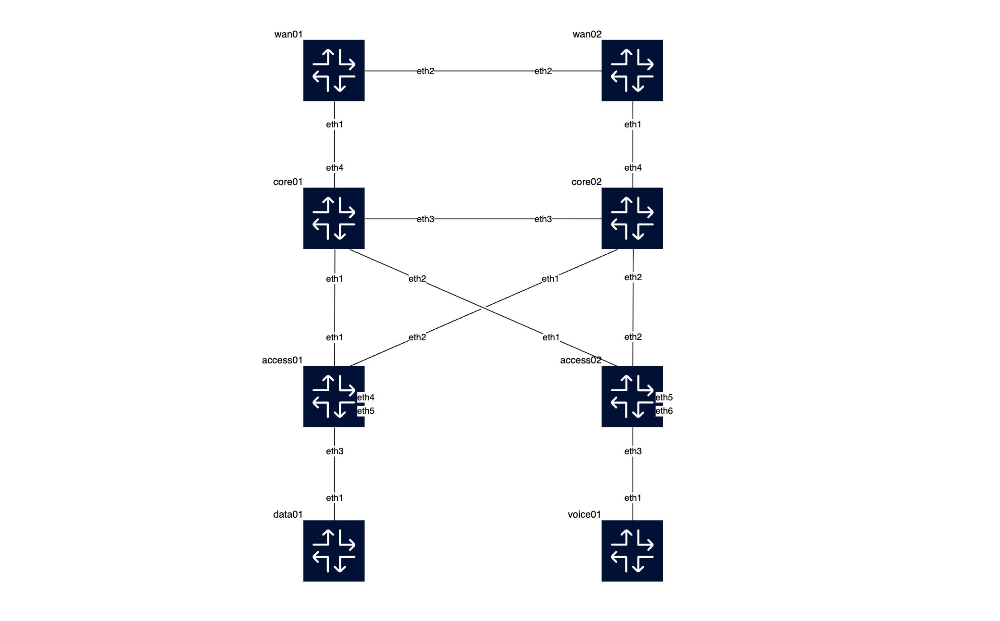

# Lab for Cisco IOS-based network
This lab consists of 2 WAN routers, 2 core switches, and 2 access switches, emulating a redundant enterprise network design.



data01 and voice01 are linux containers for testing purpose, emulating VMs. data01 is on VLAN 10 and voice01 is on VLAN 20 respectively.

## Containerlab topology definitions
### cisco.empty.clab.yml
This is a containerlab toplogy file, which includes initial sets for the network, with the aim of demoing [the ansible playbooks](../cisco-ansible-lab/README.md).

### cisco.clab.yml
This is a containerlab toplogy file, which includes a full set of configurations. This setup is equalization to the state after running the series of playbooks. 

## Prepare container images
### 1. Get Cisco Modeling Labs (CML)
Cisco requires its users to register with [Cisco Software Central](https://software.cisco.com/) before downloading any images. Once you created an account, download the latest **Cisco Modeling Labs reference platform ISO file**, for example, `refplat-20250616-free-iso.zip` from [Cisco Software Download](https://software.cisco.com/download/home). Then, extract the zip file and mount the refplat ISO. Inside, navigate to a path similar to:
```
For Mac:
$ hdiutil mount refplat-20250616-free.iso
$ cd /Volumes/REFPLAT

You can find the followings:
virl-base-images/iol-xe-<version>/
virl-base-images/ioll2-xe-<version>/ # for L2 image
```

### 2. Build the container images
First, clone the [vrnetlab](https://github.com/srl-labs/vrnetlab) repo.
```
$ git clone
$ cd vrnetlab/cisco/iol
```

Second, copy the `x86_64_crb_linux-adventerprisek9-ms.iol` into this directory and rename it to cisco_iol-x.y.z.bin (x.y.z being the version number). For L2 image, find the `x86_64_crb_linux_l2-adventerprisek9-ms.iol`.
```
$ cp <some dir>/iol-xe-17-16-01a/x86_64_crb_linux-adventerprisek9-ms.iol cisco_iol-17.16.01a.bin

For L2 image
$ cp <some dir>/ioll2-xe-17-16-01a/x86_64_crb_linux_l2-adventerprisek9-ms.iol cisco_iol-L2-17.16.01a.bin
```

Then, build.
```
$ make docker-image
```
and the image will be built and tagged. You can view the image by executing `docker images`.
```
$ docker images
REPOSITORY                TAG            IMAGE ID       CREATED       SIZE
vrnetlab/cisco_iol        L2-17.16.01a   e9d4eb619f58   2 weeks ago   615MB
vrnetlab/cisco_iol        17.16.01a      b322be02b2e1   2 weeks ago   713MB
```
Please refer to the [vrnetlab/cisco/iol](https://github.com/srl-labs/vrnetlab/tree/master/cisco/iol) for more details.

## Deploy
You can deploy the lab and consequently demo the series of playbooks. 
```
$ cd cisco-clab
$ containerlab deploy -t cisco.empty.clab.yml 
```
You can also deploy directly the state of after running the series of playbooks, if you want. One note here is that you need to run the commands manually as post-deploy works, defined in `vlan_cisco_cli.txt`,  on two access switches and on two core switches respectively. This seems to come from a restriction with containerlab environment.
```
$ containerlab deploy -t cisco.clab.yml

$ ssh admin@<container-name/id>
# en
conf t
 vlan 10
 vlan 20
 vlan 100
end
write mem
```
Please refer to the [containerlab user manual](https://containerlab.dev/manual/kinds/cisco_iol/#cisco-iol) for more details.